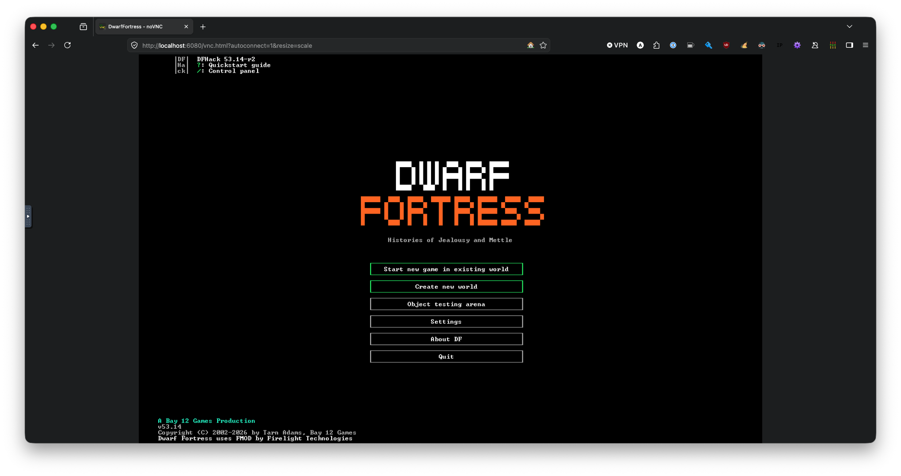
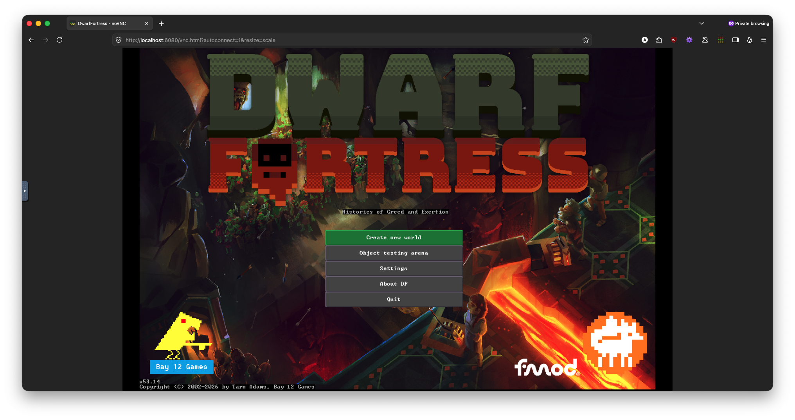
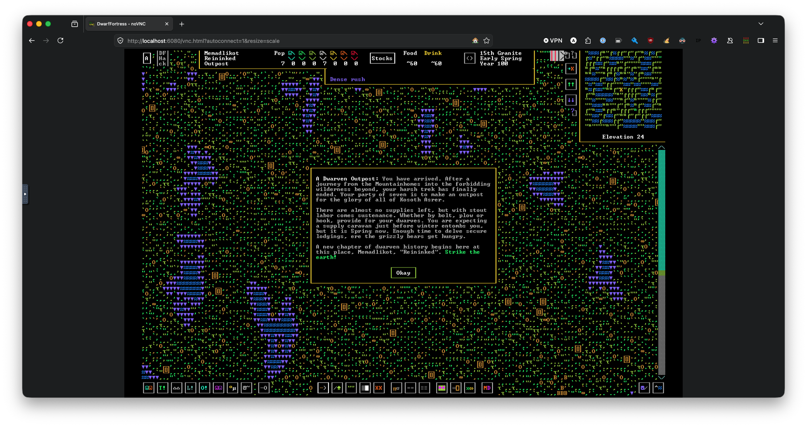
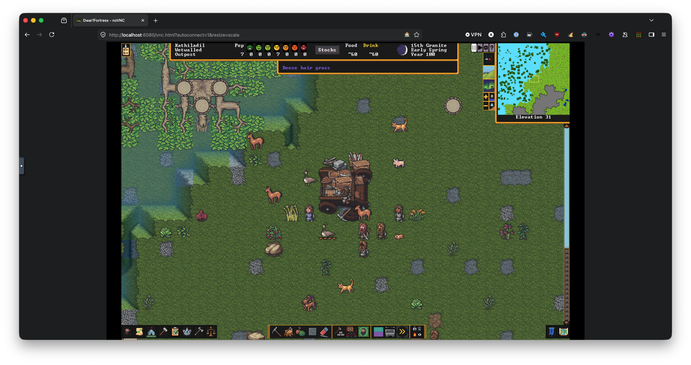

# remote-df — Dwarf Fortress in the Browser

Play [Dwarf Fortress](https://www.bay12games.com/dwarves/) (Classic or Steam edition)
in a web browser with audio. DF runs as a Docker container on a remote x86-64 Linux
host at full native speed, streamed to your browser over noVNC with audio via HTTP.

| Classic                                             | Steam (Premium)                                 |
| --------------------------------------------------- | ----------------------------------------------- |
|     |     |
|  |  |

## Architecture

```
Your machine                         Remote x86-64 Linux host (ssh <remote>)
┌──────────────────┐                 ┌──────────────────────────────────────────────────┐
│ Browser          │                 │ Docker container                                  │
│  noVNC <canvas> ─┼── SSH tunnel ──▶│  nginx :6080                                      │
│  <audio> src=    │   (loopback)    │   ├─ /          → custom index.html (VNC + audio) │
│  /audio          │                 │   ├─ /websockify → websockify → Xvnc :5900         │
│  localhost:6080  │                 │   └─ /audio      → ffmpeg Opus/WebM (internal)     │
└──────────────────┘                 │  PulseAudio (virtual sink) ◀─ dwarfort             │
                                     │  saves → host dir (bind mount, on disk)            │
                                     └──────────────────────────────────────────────────┘
```

Nothing is exposed publicly: the container binds to `127.0.0.1`, and you reach it
through an SSH tunnel.

## Prerequisites

- A remote x86-64 Linux host you can SSH into (e.g. a VPS or cloud instance)
- Docker installed on that host
- SSH client on your local machine
- A modern web browser

## Quickstart (Classic Edition)

```bash
# 1. Deploy — syncs the build context and uses Docker Compose on the remote to
#    build + start the container (saves persist on disk under ~/remote-df/saves)
./scripts/deploy.sh <ssh-host>

# 2. Open an SSH tunnel and launch it in your browser
./scripts/connect.sh <ssh-host>
#    → http://localhost:6080/vnc.html?autoconnect=1&resize=scale
#    → Audio stream: http://localhost:8080
```

## Docker Compose

`./scripts/deploy.sh` drives Compose on the remote for you. To run it by hand
instead, do this **on the remote host** (loopback-only ports, auto-restart, and
saves bind-mounted to a host directory on disk):

```bash
# Classic — build the image and run
docker compose up -d --build

# Steam — build on the host (SteamCMD needs native x86_64)
echo myuser > secrets/steam_user
echo mypass > secrets/steam_pass
echo ''     > secrets/steam_guard   # or the 2FA code if Steam Guard is on
docker compose up -d --build df-steam
```

Then tunnel in from your machine with `./scripts/connect.sh <host>`. Override
`DF_VERSION`, `GEOM`, `WEB_PORT`, `VNC_PORT`, or `DF_SAVES_DIR` (where saves live
on disk, default `./saves`) via the environment or a `.env` file.

### Example: full classic deploy with Compose

```bash
# --- on the remote x86-64 host ---
git clone https://github.com/sessa93/remote-df.git && cd remote-df

# Optional: pin settings instead of passing them inline each time
cat > .env <<'EOF'
DF_VERSION=53_14
GEOM=1600x900
WEB_PORT=6080
DF_SAVES_DIR=./saves            # host dir for saves (created on first run)
EOF

docker compose up -d --build    # build the image and start the container
docker compose logs -f df       # watch DF / Xvnc / audio boot (Ctrl-C to detach)

# --- back on your local machine ---
./scripts/connect.sh my-vps     # SSH tunnel + open the browser
#   → http://localhost:6080/
```

Day-to-day:

```bash
docker compose ps               # is it up?
docker compose restart df       # bounce it
docker compose up -d --build    # rebuild (e.g. new DF_VERSION) and restart
docker compose down             # stop & remove (saves persist in the host saves dir)
```

## Steam Edition

If you own Dwarf Fortress on Steam, you can use the premium version instead:

```bash
# Build on the remote host (SteamCMD needs native x86_64)
DF_EDITION=steam STEAM_USER=myuser STEAM_PASS=mypass ./scripts/deploy.sh <ssh-host>

# With Steam Guard 2FA:
DF_EDITION=steam STEAM_USER=myuser STEAM_PASS=mypass STEAM_GUARD=ABC123 ./scripts/deploy.sh <ssh-host>
```

Steam credentials are passed as Docker BuildKit secrets and never stored in the image.

## DFHack

The classic edition includes [DFHack](https://github.com/DFHack/dfhack) (mod framework).
DFHack is loaded via `LD_PRELOAD` to bypass the `setarch` call that requires
`SYS_ADMIN` capability unavailable in Docker containers. The steam edition does not
include DFHack.

## CI / GitHub Actions

| Workflow                                               | Trigger        | Description                                                    |
| ------------------------------------------------------ | -------------- | -------------------------------------------------------------- |
| [`build.yml`](.github/workflows/build.yml)             | Push to `main` | Builds classic edition, pushes to GHCR                         |
| [`build-steam.yml`](.github/workflows/build-steam.yml) | Manual         | Builds steam edition (needs `STEAM_USER`/`STEAM_PASS` secrets) |
| [`deploy.yml`](.github/workflows/deploy.yml)           | Manual         | Deploys to a remote host via SSH (`DEPLOY_SSH_KEY` secret)     |

Images are published to `ghcr.io/sessa93/remote-df` with tags:

- `df-{VERSION}-classic`, `classic`, `latest` (classic)
- `df-{VERSION}-steam`, `steam` (steam)

## Project Layout

| Path                                             | Purpose                                                                          |
| ------------------------------------------------ | -------------------------------------------------------------------------------- |
| [`docker/Dockerfile`](docker/Dockerfile)         | Multi-stage amd64 image: custom SDL2 + DF + audio + Xvnc + noVNC                 |
| [`docker/start.sh`](docker/start.sh)             | Entrypoint: PulseAudio, ffmpeg audio stream, display stack, DF with auto-restart |
| [`scripts/deploy.sh`](scripts/deploy.sh)         | Sync build context + `docker compose up --build` on the remote (both editions)   |
| [`docker-compose.yml`](docker-compose.yml)       | Build/run both editions; saves bind-mounted to a host dir; loopback ports        |
| [`scripts/connect.sh`](scripts/connect.sh)       | SSH tunnel (VNC + audio) + open browser (run from your machine)                  |
| [`df/g_src/`](df/g_src/)                         | Open-source platform/render wrapper (from Bay 12)                                |

## How It Works

`dwarfort` is a graphical SDL2 program, so the container gives it a headless
display: **Xvnc** (virtual X server + VNC, 1280×800) → DF renders into it using
`PRINT_MODE:2D` software rendering (no GPU needed) → **websockify/noVNC** serves
the VNC stream to the browser as a `<canvas>`. Keyboard and mouse flow back the
same way.

### Audio Streaming

A **PulseAudio** virtual null sink captures DF's audio output (via `SDL_AUDIODRIVER=pulse`).
**ffmpeg** reads from the PulseAudio monitor source, encodes to Opus/WebM at 96kbps, and serves
it internally. **nginx** proxies it at `/audio` on the same port as noVNC, and the custom
`index.html` landing page embeds an `<audio src="/audio">` element — so video and audio
are in the same browser tab with no extra ports or URLs. Latency is ~100-200ms.

### Custom SDL2 Build

DF's bundled SDL2 reads mouse input via XInput2 raw events, which VNC-injected
input does not produce — the cursor would never register. The Dockerfile builds
SDL2 with `SDL_X11_XINPUT=OFF` so DF uses core X input instead, which VNC input
generates correctly.

### Persistent Saves

Saves are bind-mounted from a host directory on the remote (`DF_SAVES_DIR`,
default `~/remote-df/saves`) to `/opt/df/data/save` in the container — so worlds
and fortresses live on disk, survive redeploys, and can be backed up or copied
with ordinary file tools (no `docker volume` plumbing).

## Configuration

| Variable     | Default    | Description                                      |
| ------------ | ---------- | ------------------------------------------------ |
| `GEOM`       | `1280x800` | Virtual display resolution                       |
| `VNC_PORT`   | `5900`     | VNC server port (internal)                       |
| `WEB_PORT`   | `6080`     | nginx port (noVNC + audio, tunneled to browser)  |
| `DF_VERSION` | `53_14`    | DF version (used in image tags and download URL) |
| `DF_EDITION` | `classic`  | `classic` or `steam`                             |

## Security

The setup assumes a single user reaching it over an SSH tunnel, so the VNC server
runs with **no password** and there's **no TLS** — which is fine over loopback +
SSH. Do **not** publish the port directly. If you ever want others to reach it:

1. Add a VNC password (`x11vnc -rfbauth`)
2. Terminate TLS in front (e.g. Caddy or nginx)
3. Open the firewall deliberately

## License

This project's scripts, Dockerfile, and configuration are released under the
[MIT License](LICENSE).

**Dwarf Fortress** itself is copyright Tarn Adams / Bay 12 Games. The game binary
and assets are not included in this repository — they are downloaded at build time.
See [Bay 12's site](https://www.bay12games.com/dwarves/) for terms.
